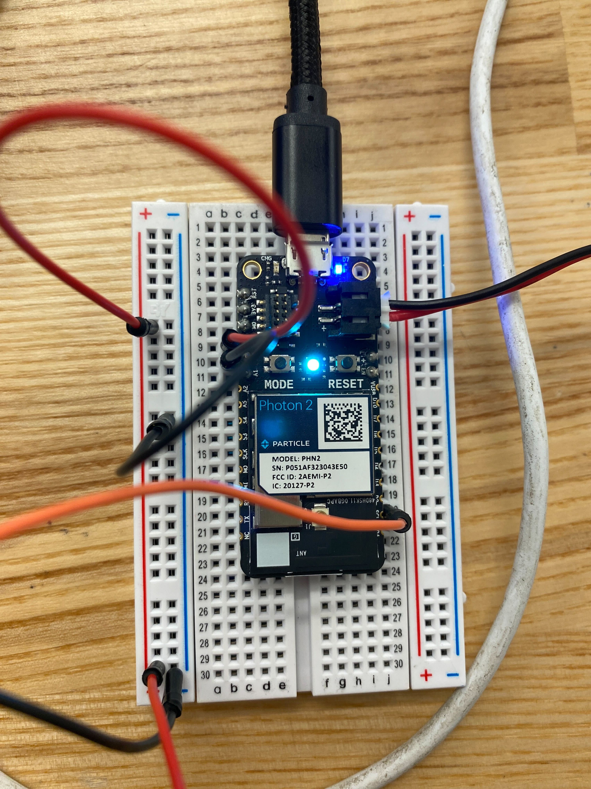

# Stephanie He, Technology Design Foundations
Welcome to my GitHub repository ^^

I'm in my masters at Berkeley, where I’m studying the design of emergent technologies such as AI, ML, and mixed reality. From physical microcontrollers to 3D modeling, I’m having a blast learning new tools and systems!
In my work, I’m excited to create tools for users with data-informed and detail-oriented design. In teams, I enjoy having a balance of autonomy and collaboration to be able to grow not only my own skills, but also together as a team.

---
# Weekly Report 11 - Week of 10/26/2023 #

## Starting final ##
Next, the class did a demo on how to write instructions for a chatbot with AI. It is interesting to experiment with this tool, and I'm excited to try to add certain prompts and see how the chatbot will incorporate and follow them! 

## Speculations ##
In the future direction of AI workbenches, there is a growing need and questions of ethical considerations in AI development. Future AI workbenches might include features that help incorporate ethical principles, avoiding biases, and ensuring responsible practices. In addition, AI workbenches can include tools for continuous monitoring of AI systems being used. This can help identify and address ethical issues over time, especially as systems interact with real-world data.

---
# Weekly Report 10 - Week of 10/26/2023 #

## Wrapping up Project 3 ##
Wrapping up our project together, we were able to finish our video and get feedback from classmates. While I was happy with the end product, I am curious about how this product can be expanded on and added to. It would be interesting to make this product more interactive and engaging with the users around it.

## Starting chatbot! ##
Next, the class did a demo on how to write instructions for a chatbot with AI. It is interesting to experiment with this tool, and I'm excited to try to add certain prompts and see how the chatbot will incorporate and follow them! 

## Speculations ##
In the future direction of AI workbenches, there is a growing need and questions of ethical considerations in AI development. Future AI workbenches might include features that help incorporate ethical principles, avoiding biases, and ensuring responsible practices. In addition, AI workbenches can include tools for continuous monitoring of AI systems being used. This can help identify and address ethical issues over time, especially as systems interact with real-world data.

---
# Weekly Report 9 - Week of 10/26/2023 #

## Wrapping up Project 2 ##
Wrapping up our project together, we were able to finish our video and get feedback from classmates. While I was happy with the end product, I am curious about how this product can be expanded on and added to. It would be interesting to make this product more interactive and engaging with the users around it.

## Starting chatbot! ##
Next, the class did a demo on how to write instructions for a chatbot with AI. It is interesting to experiment with this tool, and I'm excited to try to add certain prompts and see how the chatbot will incorporate and follow them! 

## Speculations ##
In the future direction of AI workbenches, there is a growing need and questions of ethical considerations in AI development. Future AI workbenches might include features that help incorporate ethical principles, avoiding biases, and ensuring responsible practices. In addition, AI workbenches can include tools for continuous monitoring of AI systems being used. This can help identify and address ethical issues over time, especially as systems interact with real-world data.

---
# Weekly Report 8 - Week of 10/19/2023 #

## Collaboration - Project definition ##
We were able to put together our individual parts together and connect the protons to communicate. We accessorized our rabbit, and took videos to demonstrate together. 

## Individual work ##
This week, I worked on creating a button for the rabbit to switch between modes. Then, I connected the motor, sensors, and button to communicate through the cloud based on the mode it is set on. 

## Speculations ##
For our speculation, we considered companionship of this robot with increased engagement and use of AI.
If the robot rabbit is designed to interact with humans in a friendly and engaging manner, it could serve as a source of entertainment and companionship. People might form emotional connections with the robot, enhancing their overall well-being.
If the robot rabbit utilizes AI, it may leverage sensors to gather data from its environment. AI algorithms could process this data to make informed decisions, enhancing the rabbit's ability to navigate and respond to stimuli. Natural language processing and computer vision could be integrated into the AI system, allowing the robot rabbit to understand and respond to human gestures, commands, and facial expressions. This enhances the user experience by making the interaction more intuitive and engaging.

---
# Weekly Report 7 - Week of 10/12/2023 #

## Collaboration - Project definition ##
Essentially we have a rabbit figure that has two modes: friendly and shy. Friendly rabbit will go towards movement picked up by a sensor while shy rabbit will run away from the movement. As the rabbit moves, there will also be different sound outputs based on the mode.

Then, my team and I narrowed down the steps we need to take and split up the work into tasks:
Next steps:
motor: Have Continuous Rotation Micro-Servo rotate the wheel, Start designing the rabbit figure, Code the modes, Code UI for choosing mode
Audio: Work with microphone to get sound, Different sound modes, Integrate with rabbit, Fabrication, Designing rabbit figure, Design UI

Here is pictures of the plans we made:

## Individual work ##
I worked on motors and a bit on sensor to try them out with our kits. I was able to get the motor to start running, and am working on turning it on and off with a button control.

## Speculations ##
Something we bumped into were power limitations and translations between components. The future of AI on these platforms will likely involve the development of energy-efficient algorithms and models that can run on low-power devices. Also, use of AI with microcontrollers can make AI more accessible to students and hobbyists, supporting a greater understanding of both AI and embedded systems.

---
# Weekly Report 6 - Week of 10/05/2023 #

## Collaboration - Team formation ##
This week my team and I narrowed down what we wanted to focus on. We talked about wanting to create something with 2D, 3D, or different materials like wire or textiles. We ended up splitting up into two groups based on interests. 
We split up based on if we wanted to make something that creates or destroys. 

## Planning and Research ##
Within our smaller groups, we discussed more about how to execute our idea. We ideated on how the mechanisms would work, and looked into similar projects or examples to reference. 

## Speculations ##
Although our plan is to use wires to connect the components together, wireless communication capabilities in tools may become more prevalent. This includes enhancements in protocols like Bluetooth and Wi-Fi for faster and more reliable data transfer between. In addition, I think that in the future there will be more shared projects, libraries, and resources available, making it easier for developers to build on each other's work.

---
# Weekly Report 5 - Week of 09/28/2023 #

## Collaboration - Reflection ##
This week I collaborated with classmates on ideas we want to address within a specific area. I worked with my team to consider problems and interest areas around mobility. We talked about topics we were interested in to narrow down the scope and find specific user groups. 
I took part in the discussion by building on each of our ideas including scooters, traveling, and speakers. I condensed our ideas and submitted the form to share with the rest of the class.

Then I chose projects I was most interested in, which was related to creative technology and interactive games.

## Speculations ##
With the digital space, I think theres a lot to be explored with creative tools in 3D, so I chose this as one of my interests. This can empower artists to break free from the constraints of 2D and design directly in 3D. Artists can create immersive experiences that are interesting both for the artist to use and audience to experience. 

With the gaming, I also think that gamification is a popular trend to increase engagement for users. Many industries and companies have been utilizing our innate desire for achievement and competition.

---
# Weekly Report 4 - Week of 09/21/2023 #

## Getting feedback from classmates - Reflection ##
On Thursday I was able to get feedback from classmates. While I was happy with the end product, I felt that my explanation in the video was not sufficient and needed more detail into the process and decisions made. To address this, I added more detail into each step in my final pdf paper detailing my progress and steps. This not only showed my process better, but also better encapsulated what my model in Rhino and Grasshopper was capable of.

## Setting up Proton2
In addition, I am setting up my microcontroller set and started setting up Proton2 to prepare for the workshop today. I had some trouble with connecting to Wifi and flashing to the device, but I asked for help to problem solve the situation. 

## Speculations ##
When it comes to our everyday experiences, something as simple as a headphone stand can turn into a personalized work of art, like the ribbed model in this stand. Personal items can be adjusted to exact products and other objects you own. 

With AI, smart assistants can help create designs that match your personal preferences and your workspace aesthetic. AI assistants can analyze user data and preferences to create designs specific to an aesthetic or niche. In addition, this makes getting a design or aesthetic you want to lean towards a reference point for the AI to use and incorporate. 

These tools used with AI will impact engineering as well, as the optimization for complex models with precision can be much more accurate. This potentially reduces error significantly and makes product designs ready much more quickly. Using Grasshopper, engineers can establish relationships in designs more easily with parameters. However with AI, this can be further explored by being able to use human language and thought processes to create models without needing to do the complex calculations and implications. 

But it's not just about the outer aesthetic; it's about being smart and flexible to the user needs as well. Laser-cut designs can help make the material usage far more efficient. They minimize waste and make the most of materials, making this project not just customized to one’s taste but more eco-friendly.

---

# Weekly Reports 1-3 #
[Report 1](weekly-reports/Report-1.md)

[Report 2](weekly-reports/Report-2_08.32.2023.md)

[Report 3](weekly-reports/Report-3.md)

--- 
## Quick Links, compiled here for convenience: ##

- [TDF Wiki](https://github.com/Berkeley-MDes/desinv-202/wiki) - the ultimate source for truth and information about the course and assignments
- [Google Drive Folder](https://drive.google.com/drive/folders/1OjFgu4llHn-2WayQFVWRKFyOkQ_WaQRx?usp=drive_link) - slides and other resources
- [bCourses](https://bcourses.berkeley.edu/courses/1528355) - where the grading happens

