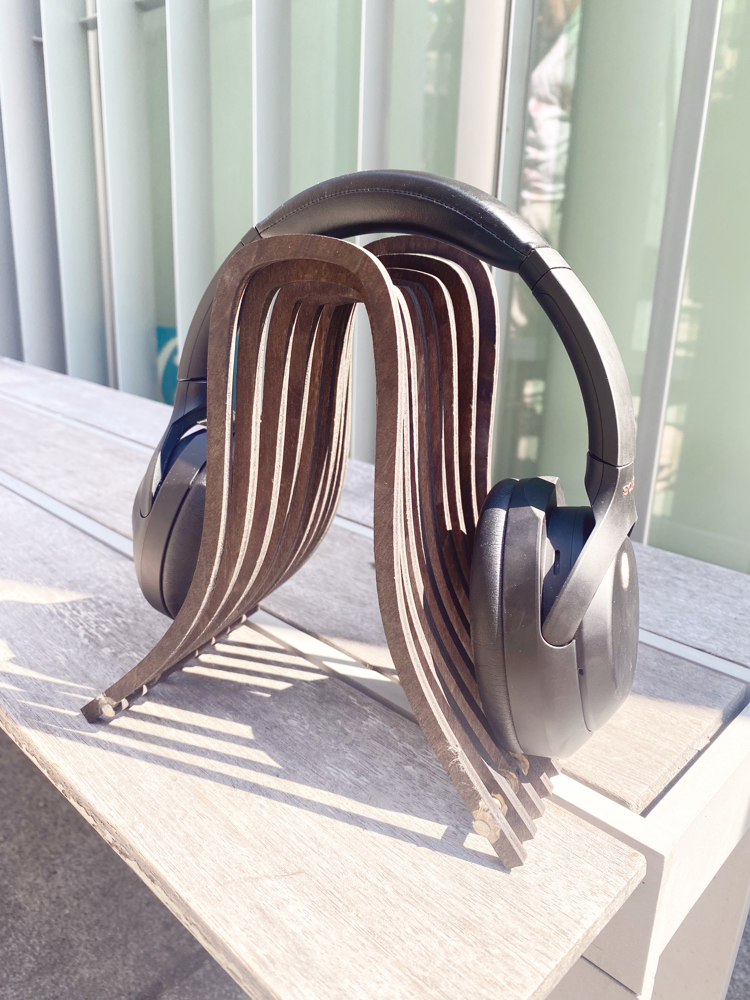

---
# Report 3 - Week of 09/14/2023 #

### Reflections
in complete sentences or paragraphs, and perhaps images or videos. reflections on what you learned and how you learned it an assessment of the state of your work

I started with a basic model with ribs to hold a headphone. This was a simple shape extruded out and offset in a series. 
I had trouble learning how to use rhino to create 2D views and create adjustable shapes, so I got help from Cody and classmates in the makerspace. 
I was able to iterate more on how the project would be designed, and I enjoyed learning more functionality in the tool.

### Speculations
in complete sentences or paragraphs, and perhaps images or videos. speculation on future direction for the tools [so much is changing very quickly right now, where do you think this is going? Why do you think this?] speculation on future direction for the work

Learning more about these tools, I think that this process can be more efficient with AI assistants. 
Personalized designs can be modeled and created based on your preferences and the aesthetics of your workspace. 
Then, with parametric modeling in Grasshopper, the given model can be further tweaked by one’s preferences. 

### Images & Video

---
